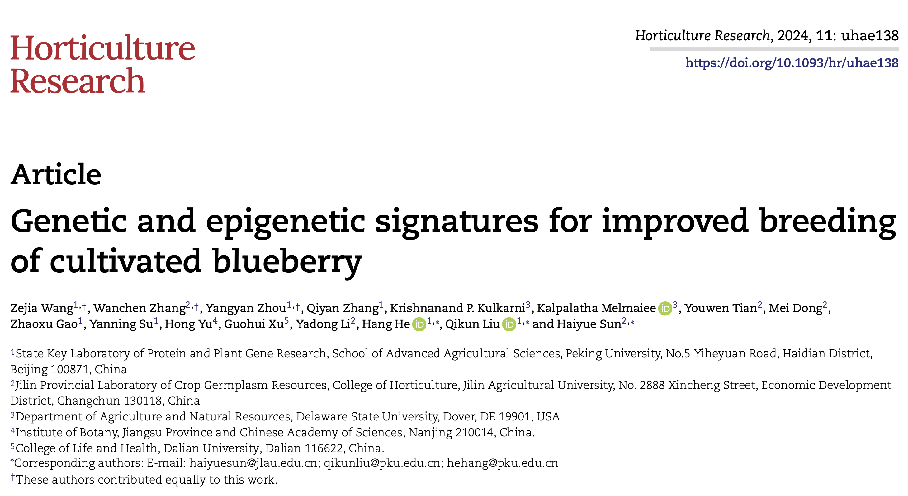
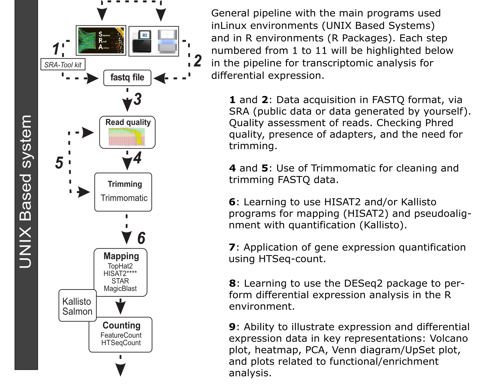
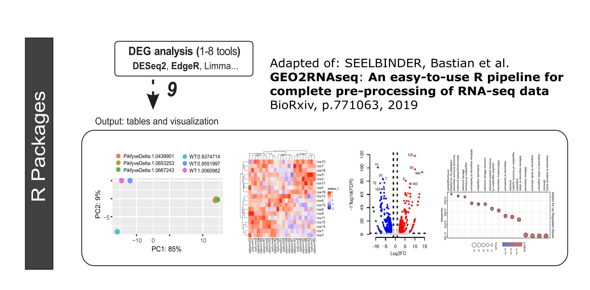
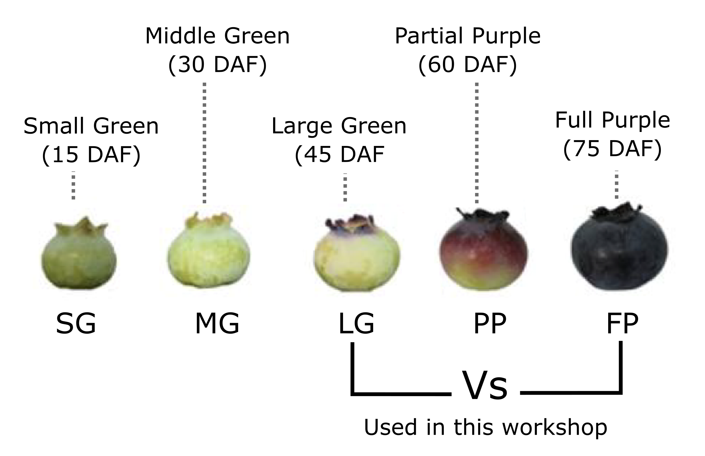
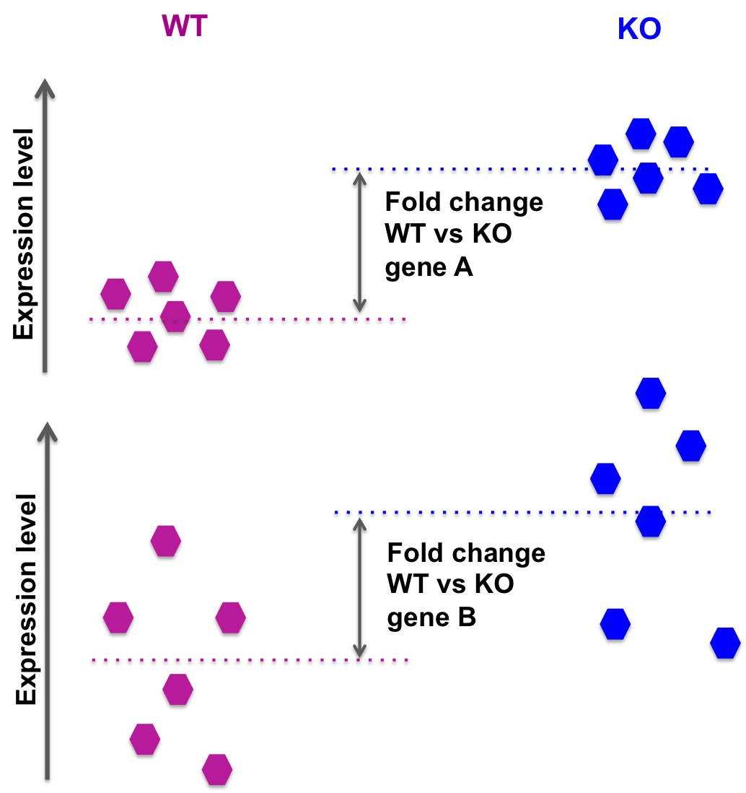
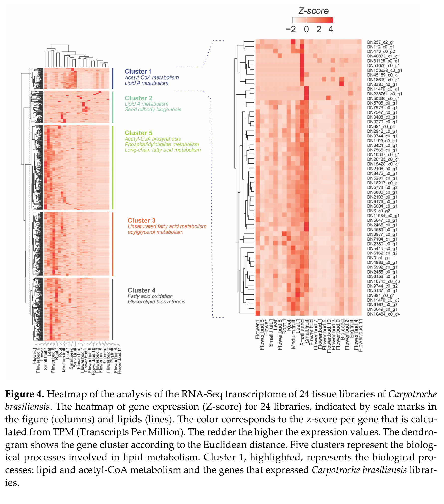

\newpage

# **INTRODUCTION**
The "RNA-seq Analysis (Using DESeq2)" workshop will provide a comprehensive overview of transcriptomic data analysis with a focus on using the DESeq2 package. This event is organized by the Blueberry Breeding Lab and will be conducted by researchers Gabriel O. Matsumoto and Edson Mario de Andrade Silva, Ph.D.
**Objective**: The main goal of the workshop is to familiarize participants with differential gene expression analysis using RNA-seq data. Participants will learn to use DESeq2, one of the most robust packages from Bioconductor for this purpose, and apply advanced data visualization techniques such as PCA and MA and Volcano plots.
**Content**: The workshop will begin with an introduction to the study context, which involves the analysis of genomic variation in 220 accessions of Vaccinium, the blueberry plant. Next, the focus will be on installing and configuring the necessary R packages, such as DESeq2, ggplot2, and pheatmap. Participants will be guided through an RNA-seq analysis pipeline, from data preprocessing to the interpretation of differential expression results.
**Methodology**: Using RNA-seq data from the study by Wang et al. (2024), which examined the expression profile of blueberry fruit at different developmental stages, the workshop will cover data preparation following expression quantification using the Htseq-count program, statistical analysis, and the creation of visualizations for result interpretation.


```{r, out.width='70%', fig.align='center', echo=FALSE}

```

The data used here are available at the following link. <https://www.ncbi.nlm.nih.gov/Traces/study/?acc=SRP429922&o=acc_s%3Aa>. This workshop is ideal for researchers and professionals interested in enhancing their skills in transcriptomic data analysis and the practical application of DESeq2 for gene expression studies.


\newpage

```{=tex}
\begin{center}
{\huge Tutorial}
\end{center}
```
#  Pipeline

## Week I

```{r, out.width='80%', fig.align='center', echo=FALSE}

```
**Figure 1.** General Pipeline with Main Programs Used in Linux Environments (UNIX Based Systems) and in R Environments (R Packages). Each step enumerated from 1 to 11 will be highlighted below in the pipeline for transcriptomic analysis for differential expression. Adapted from: Adaptado de: SEELBINDER, Bastian et al. GEO2RNAseq: An easy-to-use R pipeline for complete pre-processing of RNA-seq data. BioRxiv, p. 771063, 2019.

## Week II
```{r, out.width='80%', fig.align='center', echo=FALSE}

```

\newpage

# Data and Experimental Design

For transcriptome analysis during fruit development, samples the authors **collected at five different stages** based on changes in fruit size and external color (Fig 1), including SG, MG, **LG**, PP, **FP**. **Three replicates** were collected, with **each replicate containing six fruits**. They isolated the total RNA from fruits from the strain using the **Trizol reagent** according to manufacturer’s instructions (Invitrogen) and sent to Novogene (Tianjin, China) for **library preparation** and deep sequencing.

An illustration of the fruit stages and the stages we will use in this workshop are shown below:

```{r, out.width='80%', fig.align='center', echo=FALSE}

```


The data used were available at the link <https://www.ncbi.nlm.nih.gov/Traces/study/?acc=SRP429922&o=acc_s%3Aa>. The experimental design is on table 1 below.

**Tabela 1.** Files to be Downloaded from SRA, with Replicates, and Their Respective Conditions (Large Green - LP and Full Purple - FP)
<table style="border-collapse: collapse; width: 100%;">
  <tr>
    <th style="border-top: 1px solid black; border-bottom: 1px solid black; text-align: center; vertical-align: middle;">Condition</th>
    <th style="border-top: 1px solid black; border-bottom: 1px solid black; text-align: center;">replicate 1</th>
    <th style="border-top: 1px solid black; border-bottom: 1px solid black; text-align: center;">replicate 2</th>
    <th style="border-top: 1px solid black; border-bottom: 1px solid black; text-align: center;">replicate 3</th>
  </tr>
  <tr>
    <td rowspan="2" style="border-bottom: 1px solid black; text-align: center; vertical-align: middle;">Large Green (LG)</td>
    <td style="border-bottom: 1px solid black; text-align: center;"><a href="https://www.ncbi.nlm.nih.gov/sra/?term=SRR24002870">SRR24002870_1.fastq</a></td>
    <td style="border-bottom: 1px solid black; text-align: center;"><a href="https://www.ncbi.nlm.nih.gov/sra/?term=SRR24002875">SRR24002875_1.fastq</a></td>
    <td style="border-bottom: 1px solid black; text-align: center;"><a href="https://www.ncbi.nlm.nih.gov/sra/?term=SRR24002881">SRR24002881_1.fastq</a></td>
  </tr>
  <tr>
    <td style="border-bottom: 1px solid black; text-align: center;"><a href="https://www.ncbi.nlm.nih.gov/sra/?term=SRR24002870">SRR24002870_2.fastq</a></td>
    <td style="border-bottom: 1px solid black; text-align: center;"><a href="https://www.ncbi.nlm.nih.gov/sra/?term=SRR24002875">SRR24002875_2.fastq</a></td>
    <td style="border-bottom: 1px solid black; text-align: center;"><a href="https://www.ncbi.nlm.nih.gov/sra/?term=SRR24002881">SRR24002881_2.fastq</a></td>
  </tr>
  <tr>
    <td rowspan="2" style="border-bottom: 1px solid black; text-align: center; vertical-align: middle;">Full Purple (FP)</td>
    <td style="border-bottom: 1px solid black; text-align: center;"><a href="https://www.ncbi.nlm.nih.gov/sra/?term=SRR24002868">SRR24002868_1.fastq</a></td>
    <td style="border-bottom: 1px solid black; text-align: center;"><a href="https://www.ncbi.nlm.nih.gov/sra/?term=SRR24002873">SRR24002873_1.fastq</a></td>
    <td style="border-bottom: 1px solid black; text-align: center;"><a href="https://www.ncbi.nlm.nih.gov/sra/?term=SRR24002879">SRR24002879_1.fastq</a></td>
  </tr>
  <tr>
    <td style="border-bottom: 1px solid black; text-align: center;"><a href="https://www.ncbi.nlm.nih.gov/sra/?term=SRR24002868">SRR24002868_2.fastq</a></td>
    <td style="border-bottom: 1px solid black; text-align: center;"><a href="https://www.ncbi.nlm.nih.gov/sra/?term=SRR24002873">SRR24002873_2.fastq</a></td>
    <td style="border-bottom: 1px solid black; text-align: center;"><a href="https://www.ncbi.nlm.nih.gov/sra/?term=SRR24002879">SRR24002879_2.fastq</a></td>
  </tr>
</table>


# Installation of R Packages for Transcriptomic Analysis

In the R environment, packages will be downloaded and/or installed for the acquisition and processing of data coming from the Linux pipeline (previous programs):

## Dependencies

Below, we will install the main packages used for differential expression analysis and for plotting the graphs used to represent the results of these analyses.

```{r, message = FALSE, warning = FALSE}
# Install 'BiocManager' if it's not already installed
# BiocManager is used for installing and managing Bioconductor packages.
if (!require("BiocManager", quietly = TRUE)) install.packages("BiocManager")
```


```{r, message = FALSE, warning = FALSE}
# Check if 'vsn' package is available, if not, install it using BiocManager
# 'vsn' is used for variance stabilization and normalization of high-throughput data.
if (!requireNamespace("vsn", quietly = TRUE)) {
  BiocManager::install("vsn")
}
```

```{r, message = FALSE, warning = FALSE}
# Check if 'apeglm' package is available, if not, install it using BiocManager
# 'apeglm' is used for adaptive shrinkage of effect sizes in DESeq2 analyses.
if (!requireNamespace("apeglm", quietly = TRUE)) {
  BiocManager::install("apeglm")
}
```

```{r, message = FALSE, warning = FALSE}
# Check if 'ggplot2' package is available, if not, install it
# 'ggplot2' is used for data visualization and creating complex plots from data
# in a data frame.
if (!requireNamespace("ggplot2", quietly = TRUE)) {
  install.packages("ggplot2")
}
```


```{r, message = FALSE, warning = FALSE}
# Check if 'pheatmap' package is available, if not, install it
# 'pheatmap' is used for creating heatmaps, including clustering and annotation features.
if (!requireNamespace("pheatmap", quietly = TRUE)) {
  install.packages("pheatmap")
}
```

```{r, message = FALSE, warning = FALSE}
# Check if 'circlize' package is available, if not, install it
# 'circlize' is used for creating circular visualizations, useful for genomic data.
if (!requireNamespace("circlize", quietly = TRUE)) {
  install.packages("circlize")
}
```


```{r, message = FALSE, warning = FALSE}
# Check if 'RColorBrewer' package is available, if not, install it
# 'RColorBrewer' provides color palettes for visualizing data.
if (!requireNamespace("RColorBrewer", quietly = TRUE)) {
  install.packages("RColorBrewer")
}
```


## Dependences from Bioconductor
``` {r, message = FALSE, warning = FALSE}
# Install and load BiocManager (if not already installed)
# BiocManager is used for installing and managing Bioconductor packages.
if (!requireNamespace("BiocManager", quietly = TRUE)) {
  install.packages("BiocManager")
}
```


``` {r, message = FALSE, warning = FALSE}
# Install and load the 'enrichplot' package
# 'enrichplot' is used for visualization of functional enrichment results.
if (!requireNamespace("enrichplot", quietly = TRUE)) {
  BiocManager::install("enrichplot")
}
```

``` {r, message = FALSE, warning = FALSE}
# Install and load the 'DOSE' package
# 'DOSE' is used for disease ontology semantic and enrichment analysis.
if (!requireNamespace("DOSE", quietly = TRUE)) {
  BiocManager::install("DOSE", force = TRUE)
}
```

``` {r, message = FALSE, warning = FALSE}
# Install and load the 'clusterProfiler' package
# 'clusterProfiler' is used for statistical analysis and visualization of
# functional profiles for genes and gene clusters.
if (!requireNamespace("clusterProfiler", quietly = TRUE)) {
  BiocManager::install("clusterProfiler")
}
```

``` {r, message = FALSE, warning = FALSE}
# Install and load the 'org.Dr.eg.db' package
# 'org.Dr.eg.db' provides genome-wide annotation for Zebrafish, including mappings
# between gene IDs and biological data.
if (!requireNamespace("org.Dr.eg.db", quietly = TRUE)) {
  BiocManager::install("org.Dr.eg.db")
}
```

``` {r, message = FALSE, warning = FALSE}
# Install and load the 'ComplexHeatmap' package
# 'ComplexHeatmap' is used for creating complex and highly customizable heatmaps.
if (!requireNamespace("ComplexHeatmap", quietly = TRUE)) {
  BiocManager::install("ComplexHeatmap")
}
```

```{r, message = FALSE, warning = FALSE}
# Check if 'DESeq2' package is available, if not, install it using BiocManager
# 'DESeq2' is used for differential gene expression analysis based on the negative
# binomial distribution.
if (!requireNamespace("DESeq2", quietly = TRUE)) {
  BiocManager::install("DESeq2")
}
```


# Gene Expression Analysis:
**Data Collection:** Gene expression data is obtained through techniques such as RNA-seq or microarrays, which measure gene transcription levels in different biological samples.

**Preprocessing:** The data is preprocessed to remove noise, normalize between samples, and perform other steps to ensure the quality of the results.

**Differential Expression:** Differential expression analysis is conducted to identify genes whose expression varies significantly between different experimental conditions.

## Differential Expression Analysis Using DESeq2
Below, we will perform analyses related to the identification of differentially expressed genes. We will primarily use the DESeq2 package, based on its available pipeline in <https://bioconductor.org/packages/devel/bioc/vignettes/DESeq2/inst/doc/DESeq2.html#count-matrix-input>


``` {r, message = FALSE, warning = FALSE, fig.width=5, fig.height=6}
# Import necessary libraries
# DESeq2 is used for differential expression analysis
# ggplot2 is used for creating various plots and visualizations
# pheatmap is used for creating heatmaps to visualize data
# pasilla provides an example RNA-seq dataset for demonstration
library(DESeq2)
library(ggplot2)
library(pheatmap)
library(pasilla)

# Define the RNA-seq data directory
# This specifies the location of the directory containing RNA-seq count data in TSV format
directory <- "/Users/deandradesilvae/Documents/edson/lab_meet/workshop/vcorimb/tsv"

# Read the sample table from "sample.txt" and convert 'condition' to factor
# 'sampleTable' contains information about the samples, such as conditions
# The 'condition' column is converted to a factor to be used in the DESeq2 analysis
sampleTable <- read.table("/Users/deandradesilvae/Documents/edson/lab_meet/workshop/vcorimb/tsv/sample.txt", header = TRUE)
sampleTable$condition <- factor(sampleTable$condition)
```

``` {r, message = FALSE, warning = FALSE, fig.width=5, fig.height=6}
sampleTable
```

``` {r, message = FALSE, warning = FALSE, fig.width=5, fig.height=6}
# Create a DESeqDataSet from HTSeqCount data
# DESeqDataSetFromHTSeqCount creates a DESeq2 dataset from HTSeq count files
# The 'design' formula specifies the experimental design, in this case, the condition of the samples
ddsHTSeq <- DESeqDataSetFromHTSeqCount(sampleTable = sampleTable,
                                       directory = directory,
                                       design = ~ condition)

# Perform the DESeq analysis
# DESeq performs differential analysis, including normalization and estimation of dispersions
ddsAB <- DESeq(ddsHTSeq)
```

``` {r, message = FALSE, warning = FALSE, fig.width=5, fig.height=6}
# Get results for the comparison between conditions (LG vs. FP) and save to a file
# 'results' extracts the results of the differential expression analysis for the specified contrast
# The results are saved to a text file for further examination
resAB <- results(ddsAB, contrast = c("condition", "LG", "FP"))
```

``` {r, message = FALSE, warning = FALSE, fig.width=5, fig.height=6}
head(resAB)
```

``` {r, message = FALSE, warning = FALSE, fig.width=5, fig.height=6}
write.table(resAB, file = "resultados_diff.txt")

```

## Fold Change explanation
In a differential expression analysis, we need to know how much the expression increases or decreases between two conditions. To do this, we calculate the ratio between the expression values (e.g., **expression_in_PikfyveDelta** divided by **expression_in_WT**).

```{r, out.width='45%', fig.align='center', echo=FALSE}

```

In the picture above: the fold change for gene **A** and gene **B** is the same. However, while the groups average expression levels are similar, we observe a lot more intra-group variability in the case of gene **B**: we can then expect a lower p-value for gene **A** than gene **B**, when comparing **WT** versus **KO**.


``` {r, message = FALSE, warning = FALSE, fig.width=5, fig.height=6}
head(resAB)
```

**baseMean**: The average of normalized counts for a gene across all samples.

**log2FoldChange**:The logarithm (base 2) of the fold change in gene expression between two conditions.

**lfcSE (Log Fold Change Standard Error)**: The standard error of the log2 fold change estimate.

**stat**: The test statistic (usually a z or t value) used to compute the p-value.

**pvalue**: The p-value associated with the null hypothesis test that there is no difference in gene expression between the conditions.

**padj**: The adjusted p-value (usually adjusted for multiple testing using methods like Benjamini-Hochberg).

``` {r, message = FALSE, warning = FALSE, fig.width=5, fig.height=6}
# Transformations for data visualization
# Variance stabilizing transformation (VST) and regularized log transformation (Rlog) are
# applied for visualization
# These transformations make the data more suitable for plotting by stabilizing variance
vsd <- vst(ddsAB, blind=FALSE)
rld <- rlog(ddsAB, blind=FALSE)
```
```{r, fig.width=8, fig.height=4}
# Plot a PCA using the transformed data
# PCA (Principal Component Analysis) is used to visualize the overall patterns and relationships
# between samples
plotPCA(vsd, intgroup=c("condition", "sizeFactor"))
```
```{r, fig.width=8, fig.height=7}
# Perform shrinkage of the results matrix for MA analysis
# lfcShrink applies shrinkage to the log fold changes to improve visualization and interpretation
# Apeglm method is used here with a threshold for fold change
resApeT <- lfcShrink(ddsAB, coef=2, type="apeglm", lfcThreshold=1)

# Visualize an MA plot
# MA plot is used to visualize the relationship between fold change and average expression level
# Points are plotted with color indicating their significance
plotMA(resApeT, ylim=c(-3,3), cex=.8)

abline(h=c(-1,1), col="dodgerblue", lwd=2)
       
```

## Volcano Plot in Gene Expression Analysis:

The Volcano Plot is a graphical tool that represents the relationship between statistical significance (y-axis) and effect size or magnitude of change in expression (x-axis).

Below, we will use the **enrichGO()** function from the clusterProfiler package to identify which biological processes are associated with the **up** regulated and **down** regulated genes.


```{r, fig.width=5, fig.height=6}
# Volcano Plot
# Read the differential expression results from the "resultados_diff.txt" file
# The data is read with columns separated by spaces, and the decimal point as '.'
data_diff <- read.table("resultados_diff.txt", header = TRUE, sep = " ", dec = ".")
data_diff$gene_id <- rownames(data_diff)
colnames(data_diff) <- c("baseMean", "log2FoldChange", "lfcSE", "stat", "pvalue", "padj", "gene_id")
```


``` {r, message = FALSE, warning = FALSE, fig.width=5, fig.height=6}
head(data_diff)
```

``` {r, fig.width=5, fig.height=6}
# Plot the Volcano Plot
# The x-axis represents the log2 fold change, and the y-axis represents the -log10 adjusted p-value
#
plot(data_diff$log2FoldChange, -log10(data_diff$padj),
     pch=20,  # Point character
     xlab="Log2FC",  # X-axis label
     ylab="-log10(FDR)",  # Y-axis label
     main="12hai",  # Title of the plot
     cex=1,  # Size of the points
     xlim=c(-20,20),  # **Limits for the x-axis**
     ylim=c(0,110),  # Limits for the y-axis
     col = "#d9d9d9",  # Color for the points
     abline(h=c(1.3), v=c(-1.5,1.5), lty=3, lwd=3))  # Add horizontal and vertical lines

# Select and plot up-regulated points
# Up-regulated genes are those with an adjusted p-value < 0.05 and log2 fold change > 1.5
id <- subset(data_diff, padj < 0.05 & log2FoldChange > 1.5)

head(id)

write.table(id, file = "up_regulated.txt", sep = "\t", row.names = FALSE)  # Save up-regulated genes to a file
points(id$log2FoldChange, -log10(id$padj), pch=20, col="#bf523e", cex=1.2)  # Plot up-regulated points with a different color

# Select and plot down-regulated points
# Down-regulated genes are those with an adjusted p-value < 0.05 and log2 fold change < -1.5
id2 <- subset(data_diff, padj < 0.05 & log2FoldChange < -1.5)

head(id2)

write.table(id2, file = "down_regulated.txt", sep = "\t", row.names = FALSE)  # Save down-regulated genes to a file
points(id2$log2FoldChange, -log10(id2$padj), pch=20, col="#4d4dff", cex=1.2)  # Plot down-regulated points with a different color

# Volcano Plot
# Read the differential expression results from the "resultados_diff.txt" file
# The data is read with columns separated by spaces, and the decimal point as '.'
data_diff <- read.table("resultados_diff.txt", header = TRUE, sep = " ", dec = ".")
data_diff$gene_id <- rownames(data_diff)
colnames(data_diff) <- c("baseMean", "log2FoldChange", "lfcSE", "stat", "pvalue", "padj", "gene_id")

```


**Data Collection/Acquisition:** Expression data is obtained through techniques such as RNA-seq or microarrays.

**Preprocessing:** The data is preprocessed to remove noise, normalize between samples, and perform other steps to ensure the quality of the results.

**Differential Expression:** Differential expression analysis is performed to identify genes with significantly altered levels between different experimental conditions.

**Visual Markers:** Each point on the plot represents a gene, and genes that are significantly regulated have visual markers, such as different colors or shapes.

**x-axis (log2FoldChange):** Indicates the magnitude of change in gene expression. Positive values represent an increase in expression, while negative values indicate a decrease.

**y-axis (-log10(padj)):** Indicates statistical significance, usually represented as the negative logarithm of the adjusted p-value (padj). Points higher up indicate greater significance.

**Threshold Lines:** Vertical lines may be added to represent fold change thresholds, and horizontal lines to indicate statistical significance thresholds.

**Distant Points:** Genes located far from the center with significant log2FoldChange and p-value values indicate differential expression.

**Central Points:** Genes near the center of the plot may represent genes with little or no change in expression.

**Different Colors:** Indicate different criteria, such as genes with increased expression (red) or decreased expression (blue).

**Different Shapes:** May indicate specific gene groups or other relevant characteristics.

## Heatmap in Gene Expression Analysis:

The heatmap is a visual representation that organizes gene expression data into a color matrix, where each row represents a gene and each column represents a sample. Expression values are represented by colors, usually on a color scale ranging from cool colors (low expression) to warm colors (high expression).

``` {r, message = FALSE, warning = FALSE, fig.width=5, fig.height=12}

# Load necessary libraries
library("RColorBrewer")  # RColorBrewer is used for color palettes
library("circlize")      # circlize provides circular visualization tools     
library(ComplexHeatmap)  # ComplexHeatmap is used for creating complex heatmaps  


# Filter results to include genes with an adjusted p-value < 0.001
# Convert the filtered results to a matrix for further analysis
best <- as.matrix(subset(resAB, padj < 0.001))

# Set the criterion for sorting (e.g., adjusted p-value)
criterio <- "padj"

# Sort genes based on the chosen criterion
genes_ordenados <- resAB[order(resAB[[criterio]]), ]

# Select the top 100 genes based on the sorted results
top_100_genes <- genes_ordenados[1:100, ]

# Display the top 100 genes for verification
head(top_100_genes)

# Extract normalized expression data from DESeq2 object
expressao_data_normal <- counts(ddsAB, normalized=TRUE)

# Subset the normalized expression data to include only the top 100 genes
expressao_data_normal <- subset(counts(ddsAB, normalized=TRUE), 
                                rownames(counts(ddsAB, normalized=TRUE)) %in% 
                                  rownames(top_100_genes))

# Scale the expression data for visualization
ztexp <- scale(t(expressao_data_normal))
ztexp <- t(ztexp)

# Check the range of scaled expression values
max(ztexp)
min(ztexp)

# Define a color ramp for the heatmap
mycol <- colorRamp2(c(-1, 1, 2), c("white", "yellow", "red"))

# Create a heatmap with the top 100 genes
Heatmap(ztexp, k = 2, col = mycol,
        show_row_names = TRUE,
        show_column_names = TRUE,
        cluster_rows = TRUE,
        column_names_gp = gpar(fontsize = 7),
        row_names_gp = gpar(fontsize = 7))


```


**Ordering:**
Genes and samples are often ordered according to their expression similarities to highlight biologically relevant patterns.

**Clusters:**
Groups of genes or samples with similar expression profiles form visual clusters in the heatmap. This can reveal gene co-regulation or groups of samples with similar responses.

### Interpretation:
Heatmap analysis allows for the identification of gene expression patterns associated with different experimental conditions. For example, it is possible to observe genes that are upregulated or downregulated in response to a treatment.

### Validation of Results:
The heatmap aids in the visual validation of differential expression analysis results, helping to identify genes or samples that may be of biological interest.

### Interpretation of Colors in the Heatmap:
**Cool colors (blues):** Indicate low gene expression.
**Warm colors (reds):** Indicate high gene expression.
**Intermediate tones:** Represent intermediate levels of expression.

# Functional Enrichment Analysis
After performing  the differential expression analyses, we obtain a list of `upregulated` or `downregulated` genes. With this list, we need to determine which biological processes are represented in the data set. One analysis used for this purpose is functional enrichment analysis.

## An exemple:

In the example below, we have one of the representations that associate the expression profile with functional enrichment analysis for different clusters of hierarchical gene clustering. This Results came from [Vasconcelos et al (2022)](https://doi.org/10.3390/f13111806)

```{r, out.width='90%', fig.align='center', echo=FALSE}

```


## Hypergeometric Test Formula
The hypergeometric test formula is used to assess the **probability of observing a given number of genes annotated with a specific GO term in the target set**, given the total number of genes in the genome and the number of genes annotated with that GO term in the genome.

$$
P(X \geq k) = 1 - \sum_{i=0}^{k-1} \frac{\binom{M}{i} \binom{N-M}{n-i}}{\binom{N}{n}}
$$

Where:
- \( N \) is the total number of genes in the background set (e.g., the whole genome).
- \( M \) is the total number of genes annotated with the GO term in the background set.
- \( n \) is the number of genes in the target set (e.g., differentially expressed genes).
- \( k \) is the number of genes annotated with the GO term in the target set.
- \( \binom{a}{b} \) is a binomial coefficient representing the number of ways to choose \( b \) elements from \( a \) elements.

### Example R Code for Hypergeometric Test

Here is an example R code snippet to perform a hypergeometric test using the `phyper` function in R:

```{r}
# Example values for the hypergeometric test
# Assume we are interested in the GO term "biosynthesis of anthocyanins"
# with ID GO:0046283
# Total number of genes in the genome
N <- 20000  

# Total number of genes annotated with the GO term "biosynthesis of anthocyanins"
M <- 500    

# Number of genes in the target set (e.g., differentially expressed genes)
n <- 100    

# Number of genes annotated with the GO term in the target set
k <- 20     

# Perform hypergeometric test
p_value <- phyper(k-1, M, N-M, n, lower.tail=FALSE)
p_value
```

### Gene Ontology (GO) enrichment analysis in blueberry

As we discussed earlier, in the Hypergeometric test, it is necessary to have the annotation data for all the genes in our reference (in our case, we are using all the genes from the BLUE subgenome). Therefore, I performed a functional annotation using two tools and formatted the output to create our reference GO annotation file. These two tools are: [PANNZER2](http://ekhidna2.biocenter.helsinki.fi/sanspanz/) && [EGGNOG-mapper](http://eggnog-mapper.embl.de/).

Below, we will see an example of the already formatted annotation files to proceed with the functional enrichment analysis. But first, let's install some important packages:

``` {r, message = FALSE, warning = FALSE, fig.width=6, fig.height=8}

if (!requireNamespace("BiocManager", quietly = TRUE))
    install.packages("BiocManager")

BiocManager::install(c("AnnotationForge",
                       "clusterProfiler",
                       "enrichplot"))


#library(GO.db)
#library(AnnotationDbi)
library(AnnotationForge)
library(clusterProfiler)
library(enrichplot)
# Suponha que você tenha os seguintes arquivos
```

Now we can take a look at our annotation files necessary to build the database required to run `clusterProfiler`.

``` {r, message = FALSE, warning = FALSE, fig.width=6, fig.height=8}
fSym <- read.table("func_annotation/gene_info_2.txt", header=TRUE, sep="\t", quote="")
colnames(fSym) <- c("GID","SYMBOL","GENENAME")
head(fSym)


fGO <- read.table("func_annotation/go_annotation_2.tsv", header=TRUE, sep="\t", quote="")
colnames(fGO) <- c("GID","GO","EVIDENCE")
head(fGO)


fChr <- read.table("func_annotation/chr_data.txt", header=TRUE, sep="\t", quote="")
colnames(fChr) <- c("GID","CHROMOSOME")
head(fChr)
```

**WARNING!**: This step is essential for the construction of the OrgDB (annotation database) that will be used to run clusterProfiler. We will not execute it because this code has already been run along with the command "R CMD build org.Vcorymbosum.eg.db/" in the terminal. The resulting file is located at "ordb/org.Vcorymbosum.eg.db_0.0.3.tar.gz".

``` {r}
#makeOrgPackage(
#  gene_info=fSym, chromosome=fChr, go=fGO,
#  version = "0.0.3",
#  author = "Edson7",
#  maintainer = "Edson6 <mariodeandradee@gmail.com>",
#  outputDir = ".",
#  genus="Vaccinium",
#  species="corymbosum",
#  tax_id = "69266",
#  goTable="go"
#)
```

The command below must be executed the first time you run this code. After that, you should add a "#" at the beginning of the line with the command "install.packages("ordb/org.Vcorymbosum.eg.db_0.0.3.tar.gz", repos=NULL)".

``` {r}
## then you can call install.packages based on the return value.
## run the command on terminal: R CMD build org.Vcorymbosum.eg.db/
install.packages("ordb/org.Vcorymbosum.eg.db_0.0.3.tar.gz", repos=NULL)
```

Here we are loading the package we built using the `makeOrgPackage()` function and installed with the last command.

``` {r}
library(org.Vcorymbosum.eg.db)
```

Now we will perform the GO Enrichment Analysis of a gene set. Given a vector of genes (gene_list), this function will return the enrichment GO categories after FDR control.

``` {r}
gene_list <- readLines("../vcorimb/func_annotation/gene_list_UP.txt")

head(gene_list)

# Realizar a análise de enriquecimento GO com IDs GO válidos
ego <- enrichGO(
  gene = gene_list,
  OrgDb = org.Vcorymbosum.eg.db,
  keyType = "SYMBOL",
  ont = "BP",  # "BP" para Biological Process, "CC" para Cellular Component, "MF" para Molecular Function
  pAdjustMethod = "fdr",
  qvalueCutoff = 0.05
)
```

``` {r, message = FALSE, warning = FALSE, fig.width=8, fig.height=7}
mutate(ego, qscore = -log(p.adjust, base=10)) %>% 
  barplot(x="qscore")
```

``` {r, message = FALSE, warning = FALSE, fig.width=4, fig.height=6}
dotplot(ego, showCategory=15) + ggtitle("dotplot for ORA")
```

Performing the test using the downregulates genes data.

``` {r}
gene_list <- readLines("../vcorimb/func_annotation/gene_list_DOWN.txt")

head(gene_list)

# Realizar a análise de enriquecimento GO com IDs GO válidos
ego <- enrichGO(
  gene = gene_list,
  OrgDb = org.Vcorymbosum.eg.db,
  keyType = "SYMBOL",
  ont = "BP",  # "BP" para Biological Process, "CC" para Cellular Component, "MF" para Molecular Function
  pAdjustMethod = "fdr",
  qvalueCutoff = 0.05
)

print(ego)
```


``` {r, message = FALSE, warning = FALSE, fig.width=6, fig.height=4}

mutate(ego, qscore = -log(p.adjust, base=10)) %>% 
  barplot(x="qscore")

dotplot(ego, showCategory=15) + ggtitle("dotplot for ORA")


```

### Explanations of some metrics:

**geneRatio**: The ratio of the number of genes in the input list associated with a specific GO term to the total number of genes in that GO term within the reference database. It helps understand how enriched a particular GO term is in your input list.

**p.adjust**: The p-value adjusted for multiple testing. The adjustment method used is specified by `pAdjustMethod = "fdr"`, which stands for the False Discovery Rate. Adjusted p-values are critical because they control for the likelihood of false positives when performing multiple hypothesis tests.

**count**: The number of genes in your input list that are associated with a specific GO term. It shows how many genes from your list contribute to the enrichment of that GO term.

**qscore**: Calculated as `-log(p.adjust, base=20)`. This transformation is used to make it easier to visualize the significance of the enriched GO terms. Higher qscore values indicate more significant GO terms, as they correspond to lower adjusted p-values. In the barplot, the qscore is used as the x-axis, helping to prioritize GO terms by their significance.


